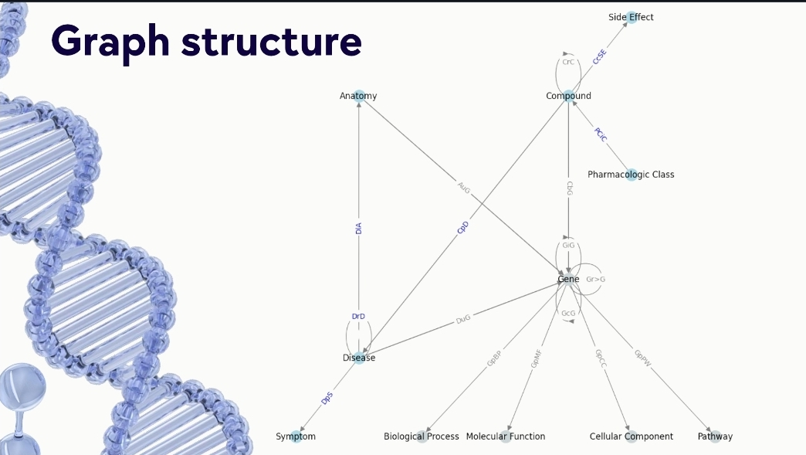

# Advanced Coding for Data Analytics Project
Computational biology and bioinformatics focus on understanding the intricate network of interactions regulating life on earth. Modeling those relations through graph-analysis formalism allows researchers to discover the fundamental molecular mechanisms which drive biological processes and human diseases, introducing novel methods to cope with the complexity of this domain.

From a computer science perspective, any biological entity can be represented as a node in the network, while interactions are modelled as edges. These graphs are thus typically heterogenous: nodes can represent different types of entity and multiple meanings are attributable to the directed links beetween each source-target couple.

In this project, we implement some of the aforementioned techniques to analyze the publicly-available Hetionet biological knowledge graph (more details in the Inputs README) and produce significant insights.

